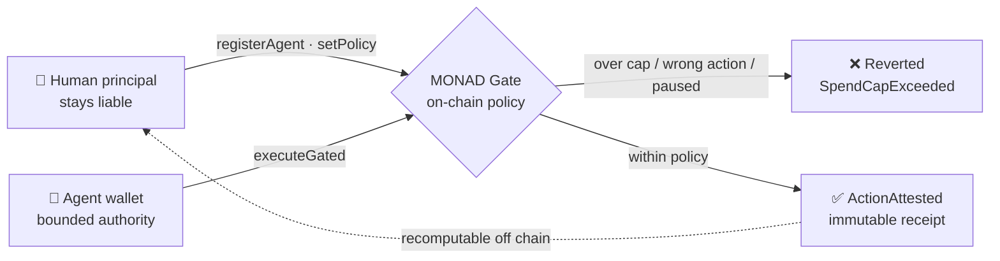
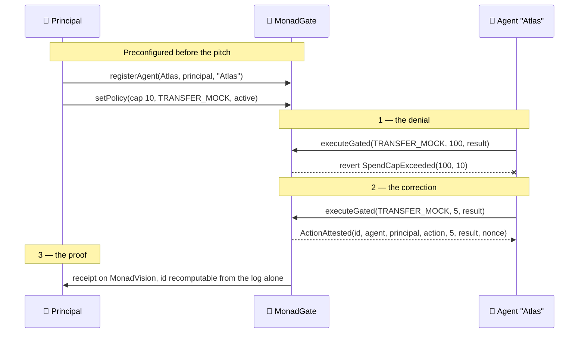
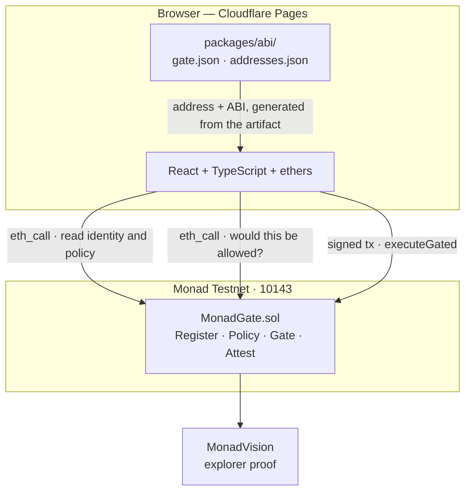

# MONAD | Gate

**Permission and proof for autonomous agents on Monad.**

An agent gets a wallet and starts acting. Who authorised it? What was it allowed
to do? Who is liable when it does something expensive?

MONAD | Gate answers all three on chain. It binds an agent wallet to a human
principal, lets that principal set a narrow action policy, refuses anything
outside it, and leaves an attestation that anyone can verify independently.

| | |
|---|---|
| **Live demo** | https://monad-gate.pages.dev |
| **Contract** | [`0x6e93CE34DB89Cf14C1846Ea65967f5506477F908`](https://testnet.monadvision.com/address/0x6e93CE34DB89Cf14C1846Ea65967f5506477F908) — source verified |
| **Network** | Monad Testnet, chain ID `10143` |
| **Tests** | 38 passing, including fuzz and stateful invariants |

---

## The idea in one diagram



The principal never hands over a blank cheque, and the agent never gets to
decide its own limits. Every allowed action leaves a receipt binding **agent,
principal, action, amount, result and nonce** — so an auditor with nothing but
the event log can reproduce the attestation id and confirm nothing was invented.

---

## The 90-second demo



1. **Identity** — the page loads real state from the contract. Atlas is bound to
   a principal who remains liable.
2. **Deny** — run the preloaded `100` action against the `10` cap. The red screen
   is the contract's own decision, evaluated on Monad, not a guess made in the
   browser.
3. **Allow** — click *Set amount to 5 units*, run it again, sign as the agent.
4. **Prove** — open the receipt on MonadVision and recompute the attestation id
   from the event.

> **Amounts are abstract policy units, not MON.** Nothing in this system moves
> value. A successful attestation proves policy evaluation, not that a payment
> settled — the UI says so, and no MON figure is displayed anywhere.

---

## How it fits together



**No backend, no database, no server secret.** Contract storage is the
persistence layer and `ActionAttested` is the audit log. The manifest
`packages/abi/addresses.json` is the single source of truth for the deployed
address — `VITE_*` variables only override it, so a build cannot silently
disagree with what was deployed and verified.

One consequence worth stating: **the deny path needs no wallet.** The UI asks the
contract via `eth_call` whether an action would be allowed, so the refusal is
real policy evaluation on Monad even before anyone connects a wallet. Only the
attestation itself requires a signature.

---

## Verify it yourself

Nothing below depends on trusting this repo.

```bash
export GATE=0x6e93CE34DB89Cf14C1846Ea65967f5506477F908
export AGENT=0xd00e55Da854b53F02Ff0fe8DD6a35f68a14E2030
export ACTION=$(cast keccak "TRANSFER_MOCK")
export RPC=https://testnet-rpc.monad.xyz

# real identity and policy
cast call $GATE "agents(address)(address,string,bool)"   $AGENT --rpc-url $RPC
cast call $GATE "policies(address)(uint256,bytes32,bool)" $AGENT --rpc-url $RPC

# the denial, straight from the contract — costs nothing
cast call $GATE "executeGated(bytes32,uint256,bytes32)(bytes32)" \
  $ACTION 100 $(cast keccak "demo") --from $AGENT --rpc-url $RPC
# → SpendCapExceeded(100, 10)
```

| Claim | Evidence |
|---|---|
| Contract matches this source | Sourcify `runtimeMatch: exact_match`, match `544618` |
| Deployed code matches the artifact | `cast code` is byte-identical to `deployedBytecode` |
| The gate really denies | `SpendCapExceeded(100, 10)` from a live `eth_call` |
| The gate really attests | tx [`0x74f68eb7…b688`](https://testnet.monadvision.com/tx/0x74f68eb7de5246d7fbfcdab49794210e48163cc33040048c5e396cdfcc9ab688) |
| The receipt is independently checkable | attestation id recomputed off chain from the event alone |
| The site matches this repo | a local build of `main` produces byte-identical asset hashes |

Every deployment value — tx, block, compiler, optimizer runs, ABI hash, explorer
URLs, verification job — is recorded in `packages/abi/addresses.json`.

---

## The contract

```solidity
registerAgent(address agent, address principal, string label)
setPolicy(address agent, uint256 maxSpend, bytes32 allowedActionId, bool active)
transferPrincipal(address agent, address newPrincipal)   // principal-key recovery
rotateAgent(address oldAgent, address newAgent)          // agent-key recovery
executeGated(bytes32 actionId, uint256 amount, bytes32 resultHash) returns (bytes32)
```

`executeGated` authenticates `msg.sender` and reverts unless the caller is the
registered agent, the policy is active, the action id matches, the amount is at
or below the cap, and the result hash has not been attested before.

Custom errors, all decoded by the UI rather than shown as raw selectors:

`ZeroAddress` · `AgentNotRegistered` · `NotPrincipal` · `PolicyInactive` ·
`ActionNotAllowed` · `SpendCapExceeded` · `AgentAlreadyRegistered` ·
`PrincipalIsAgent` · `ResultAlreadyAttested`

**Guarantees the tests enforce**, not just intentions:

- an unrelated caller can never overwrite a registered agent;
- principal and agent can never be the same address;
- only the stored principal mutates policy, rotates, or transfers authority;
- a denied action never emits an attestation and never consumes a result hash;
- the same result hash cannot be attested twice by the same agent;
- **the nonce advances exactly once per accepted action** — proven by a stateful
  invariant driving the gate over 128,000 calls, which is what makes the
  attestation id reconstructible off chain.

---

## Repository

```text
monad-project/
├── contracts/
│   ├── src/MonadGate.sol          # Register · Policy · Gate · Attest
│   ├── test/                      # unit · authorization · attestation · fuzz + invariants
│   └── script/Deploy.s.sol
├── packages/abi/
│   ├── gate.json                  # generated from the compiler artifact, never hand-edited
│   └── addresses.json             # deployment, verification and proof of record
├── ui/                            # React + TypeScript + ethers, no backend
├── tools/sheet_sync.py            # publishes the control plane to an operator sheet
├── docs/                          # contracts: build, deploy, test, security, demo
└── control-plane/                 # live lane board, session coordination, evidence log
```

This repo is doc-driven. Start at [`docs/DOC-SYSTEM.md`](docs/DOC-SYSTEM.md) — it
maps every doc and states which one wins when two disagree. The live work queue
is [`control-plane/ACTIVE_LANE_BOARD.md`](control-plane/ACTIVE_LANE_BOARD.md),
and every closed lane leaves evidence in
[`control-plane/ENGINEERING_SUPERVISOR.md`](control-plane/ENGINEERING_SUPERVISOR.md).

---

## Run it locally

```bash
git clone --recurse-submodules https://github.com/floating-astronaut/monad-project.git
cd monad-project
```

`--recurse-submodules` matters: `forge-std` is vendored as a submodule. An
existing clone can catch up with `git submodule update --init --recursive`.

**Frontend** — needs Node 20+:

```bash
cd ui
npm ci
npm run dev          # http://localhost:5173
```

It points at the deployed contract out of the box, because the address comes
from the manifest. No `.env` needed.

**Contracts** — needs [Monad Foundry](https://docs.monad.xyz/guides/deploy-smart-contract/foundry):

```bash
cd contracts
forge fmt --check
forge build
forge test               # 38 tests
forge snapshot --check   # fails if gas moved unexpectedly
```

Deployment, verification and the address manifest are covered in
[`docs/MONAD-DEPLOYMENT.md`](docs/MONAD-DEPLOYMENT.md). Use a Foundry keystore —
never a pasted private key.

---

## Scope and honest limits

Deliberately **not** built: multi-chain, custody or payments, compliance
workflows, agent swarms, an off-chain database, a marketing site.

Known limitations, stated rather than buried:

- **Attestation ≠ execution.** A successful attestation proves the policy
  allowed the action. It does not prove any downstream work happened.
- **Replay keying is per agent.** `rotateAgent` moves an identity to an address
  with an empty replay set, so a previously attested result hash can be reused
  after rotation. Covered by a passing test rather than discovered later; global
  keying would close it but would let any agent burn another agent's hash.
- **A missing file under `/assets/`** returns the SPA shell with status 200
  instead of a 404. Cloudflare Pages cannot express both that and the SPA
  fallback in `_redirects`; fixing it properly needs a Pages Function.
- **One policy, one action.** Multiple actions and rolling spend windows are
  post-hackathon.

Built for the agent economy on Monad.
